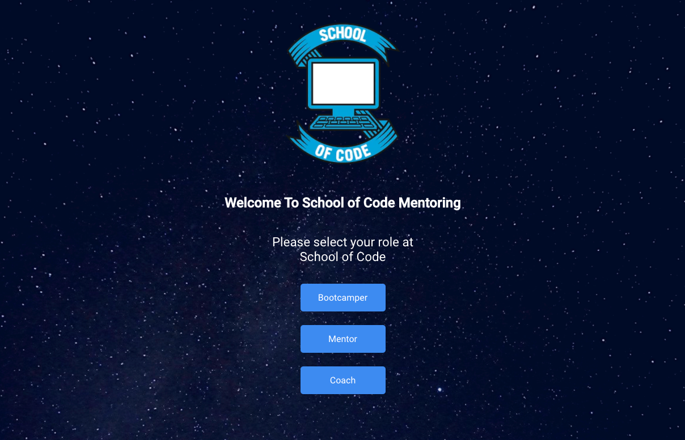
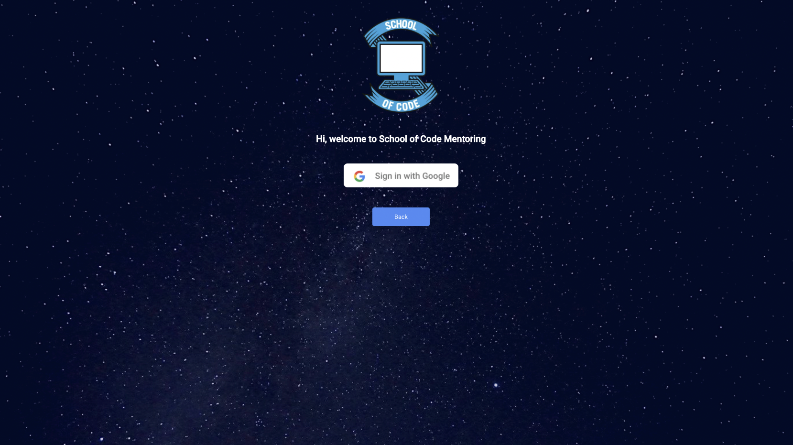
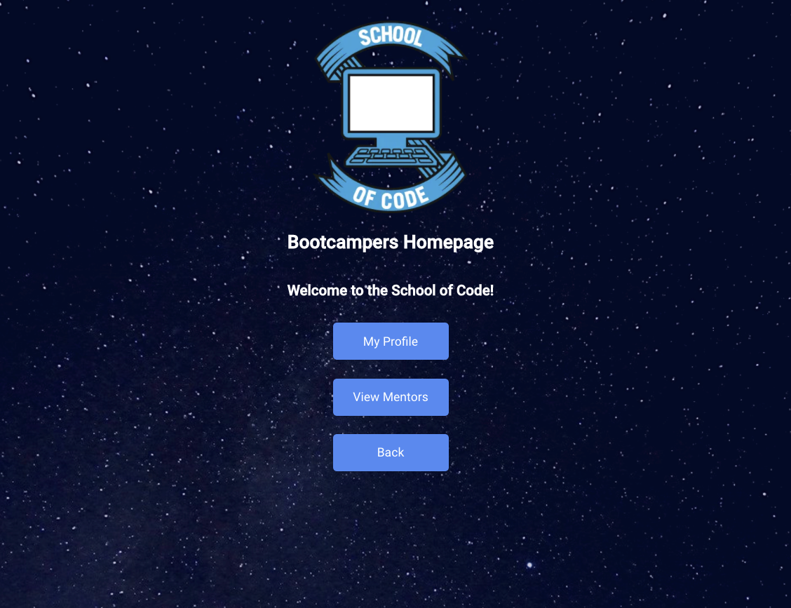
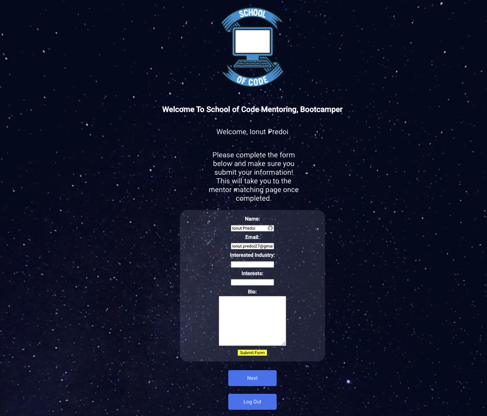
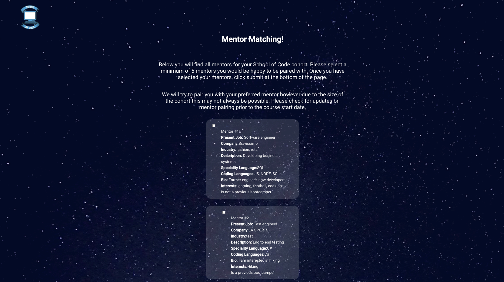
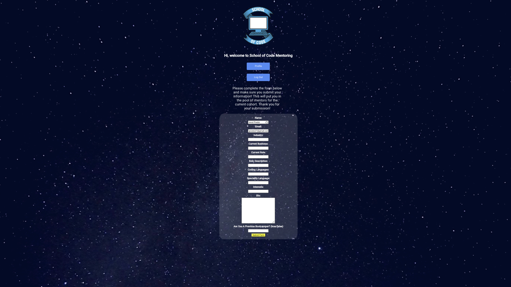
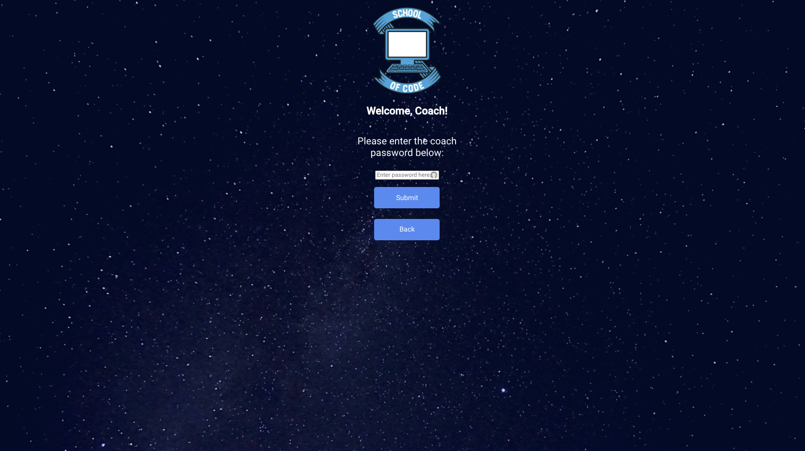
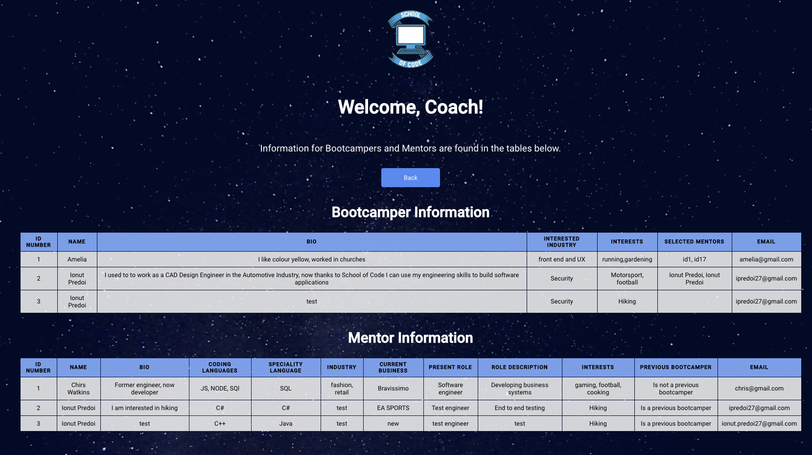

# Mentor Matching Application

## School of Code 1 Week Project

### Laura Ashcroft | The Internet Explorers

During week 8 of School of Code, we were tasked with making a full stack application. With only 1 day to plan, 3 days to code and the final day to present, my team created a complete application for a better mentor matching system at SoC.

This application allows:

- Mentors to register and submit information about their professional interests, current job, experience, etc.
- School of Code bootcampers to find a suitable mentor who work in tech to support them.
- Bootcampers to view all the mentors and submit their preferences.
- School of Code coaches to view all mentors and bootcampers, so they can easily pair them by preferences.

### Tech Stack:

- `Create React App`
- `JSX`
- `Firebase Authorisation`
- `CSS Modules`
- `HTML5`

### How To Use

1. Select from the following options to determine the path:
   - Bootcamper
   - Mentor
   - Coach
2. If you are a bootcamper:
   - Log in with your Google account and create a profile with your information.
   - Select which mentors you would prefer to be matched with during your time at School of Code.
   - Submit your choices.
   - Check your profile and which mentors you have selected.
3. If you are a mentor:
   - Log in with your Google account and create a profile with your information.
   - Check your profile.
4. If you are a coach:
   - Enter the coach password to gain access to the tables.
   - Check both the bootcamper information and mentor information to pair them together.

### Installation

1. Clone or download this repository.
2. Download the required npm modules by entering `npm i` into the terminal.
3. Run the application by entering `npm start` into the terminal.

### Mentor Matching Homepage

### Sign In With Google

### Bootcamper Homepage

### Bootcamper Sign Up

### Bootcamper Select Mentors

### Mentor Sign Up

### Coach Password Page

### Coach Information Page

